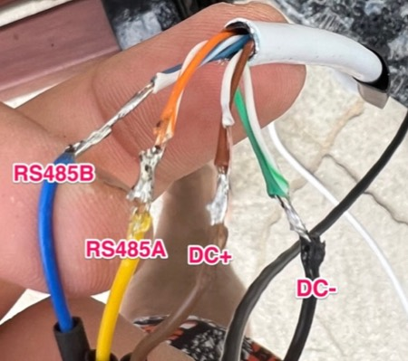
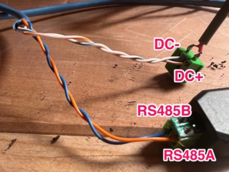
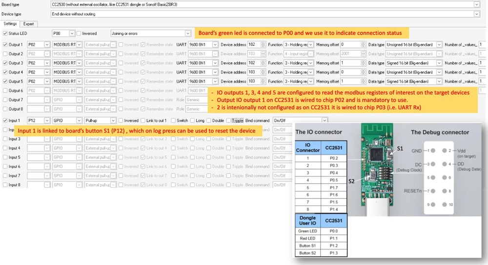

## Sensors documentation
[ZTS-3001-TR-*-N01 five pin soil sensor](sensor-manual.pdf)


## Sensors config
| Device | ID | Baudrate
| --- | :---: | :---: |
| T & H Front Garden | 101 | 9600 |
| T & H Grass Area | 102 | 9600 |
| T & H Flower Garden | 103 | 9600 |
| T, H, PH & Conductivity | 104 | 9600 |


## Wiring
| Wires | A | B | DC+ | DC- |
| --- | :---: | :---: | :---: | :---: |
| At sensors | Yellow | Blue | Brown | Black |
| Backyard sensors connection cables  | Orange | Blue | Orange - White | Blue - White |
| Front sensor connection cables  | Orange <br> Orange - White | Blue <br> Blue - White | Brown <br> Brown - White | Green <br> Green - White |
| Twisted pair | Brown | Black | - | - |

### Front sensor



### Backyard sensors




## Python sample code
[Configure instrument](configure_instrument.py)

[Read instrument](read.py)

[Read ethernet](read_ethernet.py)

[Publish to mqtt](publish_to_mqtt.py)


## PTVO firmware for backyard sensors reading

CC2531 dongle with PTVO firmware is used to read the modbus data and transmit using zigbee2mqtt. Firmware from https://ptvo.info/ 

The firmware implements a simple MODBUS RTU master mode and reads instruments holding registers.

On CC2531 UART uses P02 and P03 pins connected respectively to IO 1 and 2. Only P02 pin should be used in the configuration, but both IO1 and IO2 connected physically to the dongle via the the UART (TTL) to RS485  converter.

###  Physical connections
| Device | Pin | Pin | Pin | Pin | Pin | Pin |
| --- | :---: | :---: | :---: | :---: | :---: | :---: |
| Sensor | A | B |  |  |  |  |
| UART to RS485 board | A | B | Tx | Rx | VCC | GND |
| CC2531 IO pinout |  |  | IO1 | IO2 |  |  |  |
| CC2531 USB port |  |  |  |  | USB1 / +5V | USB4 / GND |

On the CC2531 P02 of the chip is connected to pin 1 of the IO connector and P03 to pin 2 of the IO. Therefore the Tx and Rx physical connections as specified above.


###  Firmware Configuration

PTVO documentation how to configure MODBUS:  https://ptvo.info/zigbee-configurable-firmware-features/external-sensors/modbus/

* Only P02 pin should be used in the configuration interface, P03 is needed, but is enabled automatically by the firmwared.
* Green led is the status led
* Input 1, defined as switch, allows device reset. It is connected to S1



### Flash the firmware

https://www.zigbee2mqtt.io/guide/adapters/flashing/alternative_flashing_methods.html#with-raspberry-pi-3min

### Custom converter for zigbee2mqtt 
For zigbee2mqtt to recongnize the device properly, custom converter shall be saved from the PTVO screen expert options screen and added to zigbee2mqtt: https://www.zigbee2mqtt.io/guide/configuration/more-config-options.html#external-converters

Custom names and descriptions of the exposed data can be defined in device constant within the converter js file.

```javascript
const device = {
    zigbeeModel: ['mtReader'],
    model: 'mtReader',
    vendor: 'Custom devices (DiY)',
    description: '[Configurable firmware](https://ptvo.info/zigbee-configurable-firmware-features/)',
    fromZigbee: [fz.ignore_basic_report, fz.ptvo_switch_analog_input, fz.ptvo_multistate_action, fz.legacy.ptvo_switch_buttons, fz.ptvo_on_off_config,],
    toZigbee: [tz.ptvo_switch_trigger, tz.ptvo_switch_analog_input, tz.ptvo_on_off_config,],
    exposes: [exposes.numeric('l1', ea.STATE).withDescription('Grass area - Moisture'),
      exposes.numeric('l3', ea.STATE).withDescription('Grass area - Temperature'),
      exposes.numeric('l4', ea.STATE).withDescription('Side garden - Moisture'),
      exposes.numeric('l5', ea.STATE).withDescription('Side garden - Temperature'),
      e.action(['single', 'double', 'triple', 'hold', 'release']),
      ...ptvo_on_off_config_exposes('l1'),
],
    meta: {
        multiEndpoint: true,
        
    },
    endpoint: (device) => {
        return {
            l1: 1, l3: 3, l4: 4, l5: 5,
        };
    },
    configure: async (device, coordinatorEndpoint, logger) => {
            const endpoint = device.getEndpoint(1);
      await endpoint.read('genBasic', ['modelId', 'swBuildId', 'powerSource']);
    },

};
```